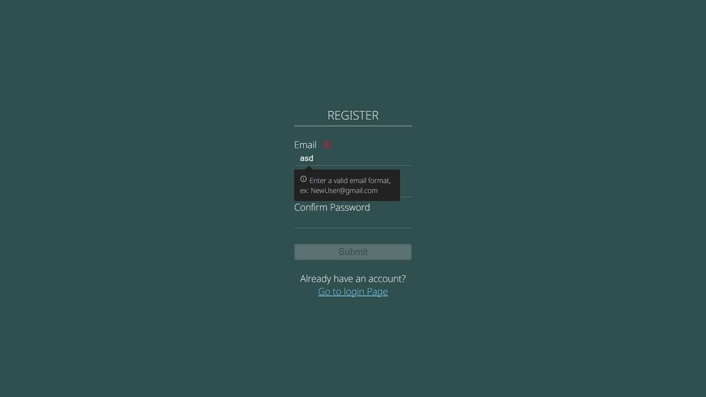
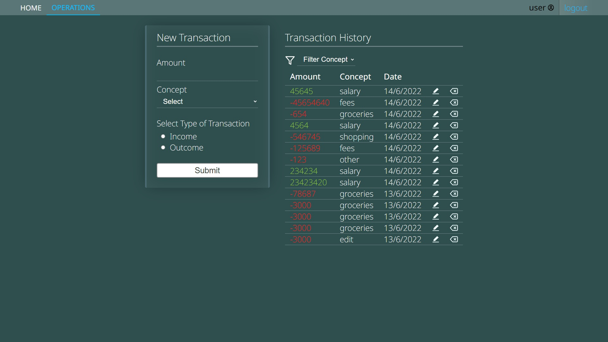
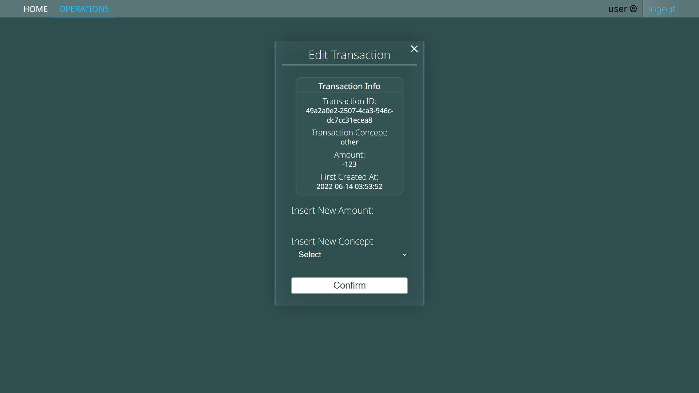
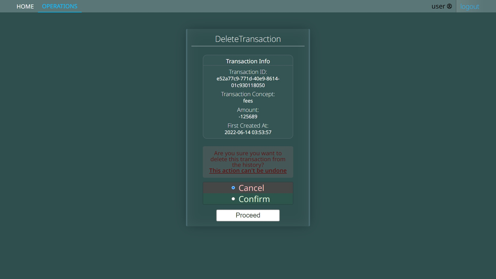
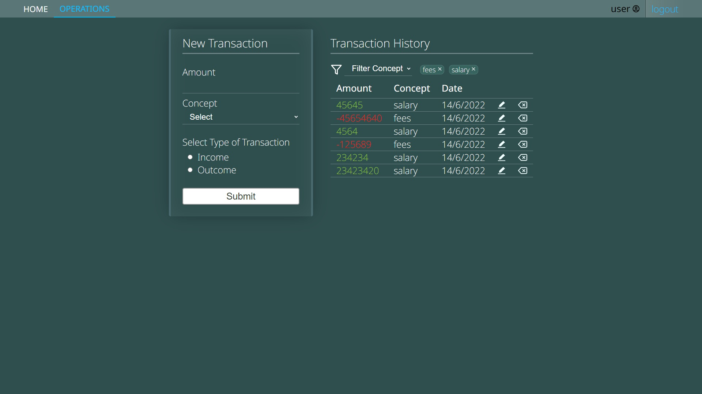
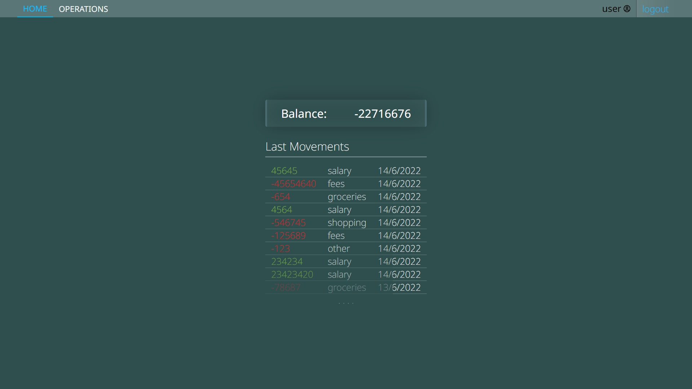

# Stocktaking full-stack app

This repo contains a server-side app built with `Node`, `Express`, and `Prisma` (`MySQL`).

It exposes some endpoints to handle user registration/authentication.

Once authenticated a user is able to handle/keep track of personal budget through CRUD operations against the DB.

The front-end is `React`, `React-Router` and `Axios`, styled with vanilla CSS (at `./client`)

The state is managed through native context API.

## Some of the app features:
- [x] Multi-device sessions
- [x] Session security (through http-only secure cookies, and token rotation/resuse detection)
- [x] Custom UI design, responsive and user-friendly

## Some todos:
- [ ] Add accesibility to CRUD ops (already implemented on register/auth forms)
- [ ] Add posibility to not-remember the session when closing tab (no auto-refresh on load)
- [ ] Add filtering by amount and date of transaction (by concept already implemented)
- [ ] Email confirmation on registration (to ultimately offer password resetting and user deletion)

## Some extra  ✨ *fancy* ✨ todos:
- [ ] Color themes
- [ ] A time/cashflow visual chart on homepage 

***

### Previews!!

